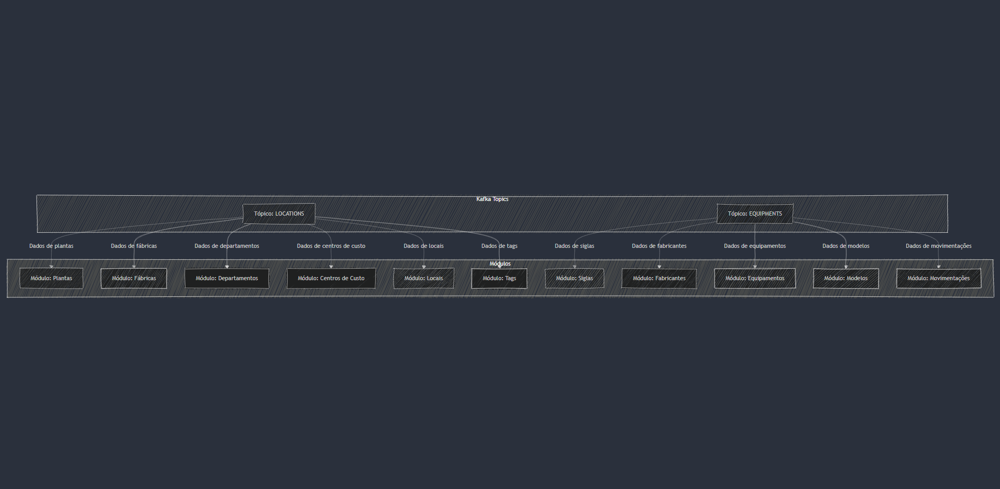
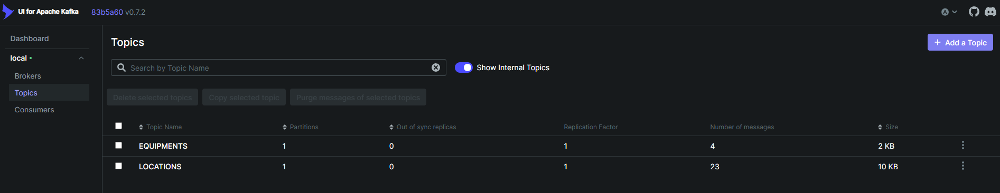

# Arquitetura do Kafka com Tópicos LOCATIONS e EQUIPMENTS

Este documento descreve a arquitetura de um sistema baseado no Kafka, com foco nos tópicos **LOCATIONS** e **EQUIPMENTS**, responsáveis por armazenar dados de diferentes módulos e eventos relacionados.

## Estrutura Geral

O Kafka é utilizado como a principal plataforma de mensageria e streaming de dados entre os diferentes módulos do sistema. Cada tópico é configurado para receber, armazenar e distribuir mensagens estruturadas no formato JSON, facilitando a integração entre sistemas.

---

## Tópico: LOCATIONS

### Descrição

Responsável por armazenar os dados relacionados à organização espacial e hierárquica das plantas, fábricas, departamentos, centros de custo, locais e tags.

### Exemplos de Dados Armazenados

- Plantas
- Fábricas
- Departamentos
- Centros de custo
- Locais
- Tags

### Formato da Mensagem

### **Planta**

##### **Registration**

```json
{
  "message_id": "1733447603805-equipment_service-a19a3f",
  "timestamp": "2024-12-06T01:13:23.805Z",
  "source_system": "equipment_service",
  "destination_system": "voyager-2",
  "event_type": "plant_registration",
  "user": "admin",
  "payload": {
    "plant_id": "675c519cb974961ae4eeac45",
    "name": "THOR",
    "status": true
  }
}
```

### Fábrica

#### **Registration**

```json
{
  "message_id": "1733447821171-equipment_service-f6df9e",
  "timestamp": "2024-12-06T01:17:01.171Z",
  "source_system": "equipment_service",
  "destination_system": "voyager-2",
  "event_type": "factory_registration",
  "user": "admin admin",
  "payload": {
    "factory_id": "675c519cb974961ae4eeac45",
    "factory_plant": "67524fb36c6cb6df475609a2",
    "name": "FABRICA A",
    "status": true
  }
}
```

### Departamento

#### **Registration**

```json
{
  "message_id": "1733448052093-equipment_service-8dc086",
  "timestamp": "2024-12-06T01:20:52.093Z",
  "source_system": "equipment_service",
  "destination_system": "voyager-2",
  "event_type": "department_registration",
  "user": "admin admin",
  "payload": {
    "department_id": "675c519cb974961ae4eeac45",
    "factory": "6752508d6c6cb6df475609a3",
    "name": "DEP A",
    "status": true
  }
}
```

### Centro de Custo

#### **Registration**

```json
{
  "message_id": "1733448113961-equipment_service-783fdb",
  "timestamp": "2024-12-06T01:21:53.961Z",
  "source_system": "equipment_service",
  "destination_system": "voyager-2",
  "event_type": "cost_center_registration",
  "user": "admin admin",
  "payload": {
    "cost_center_id": "675c519cb974961ae4eeac45",
    "department": "675251746c6cb6df475609a4",
    "name": "CENTRO THOR",
    "status": true
  }
}
```

### Local

#### **Registration**

```json
{
  "message_id": "1733448172516-equipment_service-d36477",
  "timestamp": "2024-12-06T01:22:52.516Z",
  "source_system": "equipment_service",
  "destination_system": "voyager-2",
  "event_type": "location_registration",
  "user": "admin admin",
  "payload": {
    "location_id": "675c519cb974961ae4eeac45",
    "department": "675251746c6cb6df475609a4",
    "name": "LOC A",
    "initials": "LCA",
    "status": true
  }
}
```

### Tag

#### **Registration**

```json
{
  "message_id": "1733448231263-equipment_service-205b74",
  "timestamp": "2024-12-06T01:23:51.263Z",
  "source_system": "equipment_service",
  "destination_system": "voyager-2",
  "event_type": "tag_registration",
  "user": "admin admin",
  "payload": {
    "tag_id": "675c519cb974961ae4eeac45",
    "location": "675251ec6c6cb6df475609a6",
    "status": true
  }
}
```

## Tópico: EQUIPMENTS

### Descrição

Responsável por armazenar os dados relacionados aos equipamentos, incluindo suas movimentações, modelos e associações.

### Exemplos de Dados Armazenados

- Siglas
- Fabricante
- Modelos
- Equipamentos
- Movimentações

### Formato da Mensagem

### Tipo/Sigla

#### **Registration**

```json
{
  "message_id": "1733448275747-equipment_service-94a59a",
  "timestamp": "2024-12-06T01:24:35.747Z",
  "source_system": "equipment_service",
  "destination_system": "voyager-2",
  "event_type": "types_registration",
  "user": "admin",
  "payload": {
    "types_id": "675c519cb974961ae4eeac45",
    "name": "THOR",
    "initials": "THO",
    "status": true
  }
}
```

### Fabricante

#### **Registration**

```json
{
  "message_id": "173384551924vice-cc5bd1",
  "timestamp": "2024-12-10T15:45:19.243Z",
  "source_system": "equipment_service",
  "destination_system": "voyager-2",
  "event_type": "manufacturer_registration",
  "user": "admin admin",
  "payload": {
    "manufacturers_id": "675c519cb9749ac45",
    "name": "Fabricante X",
    "cnpj": "47.960.950/0001-21",
    "status": true
  }
}
```

### Modelos

#### **Registration**

```json
{
  "message_id": "1733845617075-equipment_service-2f9f2a",
  "timestamp": "2024-12-10T15:46:57.075Z",
  "source_system": "equipment_service",
  "destination_system": "voyager-2",
  "event_type": "model_registration",
  "user": "admin admin",
  "payload": {
    "model_id": "675c519cb9749ac45",
    "equipment_type": "672e2993327fab9cbac786e4",
    "name": "MODELO X",
    "manufacturer": "6758620f47d23f648aa96ba1",
    "status": "true",
    "removedFiles": "[]",
    "files": []
  }
}
```

### Equipamentos

#### **Registration**

```json
{
  "message_id": "1733719006926-equipment_service-a5c9ef",
  "timestamp": "2024-12-09T04:36:46.926Z",
  "source_system": "equipment_service",
  "destination_system": "voyager-2",
  "event_type": "equipment_registration",
  "user": "admin admin",
  "payload": {
    "equipment_id": "675c519cb9749ac45",
    "equipment_model": "67478799951405bff298e07e",
    "is_active_status": "true",
    "cost_center_id": "674e070fd29124881c8d1ba8",
    "serial_number": "IPHO13",
    "fixed_asset_number": "IPHO13",
    "digital_twin": "opc.tcp://10.60.100.85:4848"
  }
}
```

### Movimentação

#### **Registration**

```json
{
  "message_id": "1733845697955-equipment_service-b23add",
  "timestamp": "2024-12-10T15:48:17.955Z",
  "source_system": "equipment_service",
  "destination_system": "voyager-2",
  "event_type": "movement_registration",
  "user": "admin admin",
  "payload": {
    "movement_id": "675c519cb9749ac45",
    "equipment": "674f413533c2c1934961faeb",
    "destination": "674f71fe9612e1091ef88839"
  }
}
```

## Estrutura do Payload

Ambos os tópicos compartilham um padrão de mensagem que facilita a integração e rastreabilidade.

### Campos Gerais

- **message_id**: Identificador único da mensagem, combinando timestamp, sistema de origem e ID único.
- **timestamp**: Data e hora do evento no formato ISO 8601.
- **source_system**: Nome do sistema que originou o evento.
- **destination_system**: Nome do sistema de destino.
- **event_type**: Tipo do evento ocorrido (e.g., `plant_registration`, `plant_modification` e `plant_removal`).
- **user**: Usuário responsável pela alteração.

### Payload Específico

- **LOCATIONS**: Contém informações sobre locais e suas associações.
- **EQUIPMENTS**: Inclui dados sobre equipamentos e movimentações.




