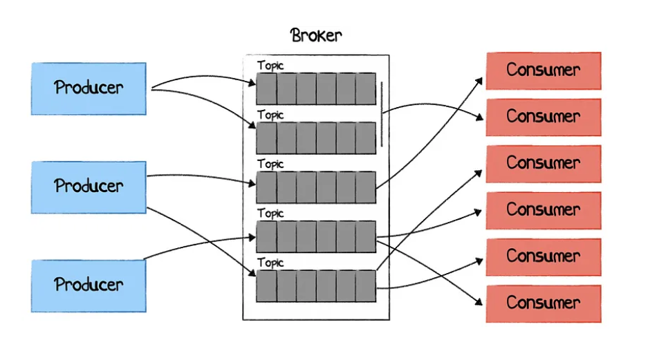
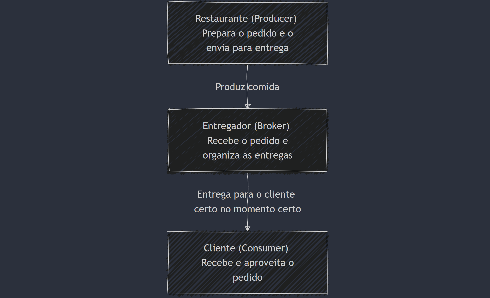

# Apache Kafka e Kafka-UI: Guia Completo

## O que é Apache Kafka?

Kafka é uma plataforma de mensageria distribuída que conecta sistemas enviando dados de forma rápida e confiável. No fluxo básico, o Producer é responsável por enviar mensagens para o Kafka, que as organiza em tópicos através de seus Brokers, que funcionam como intermediários, armazenando e gerenciando essas mensagens. Por fim, o Consumer lê as mensagens dos tópicos que precisa, garantindo que os sistemas recebam as informações certas no momento certo. Esse processo permite a comunicação eficiente entre diversas aplicações.



Em um serviço de entrega de comida. O Producer seria o restaurante que prepara o pedido e coloca a comida para entrega. O Broker é como o entregador, que pega o pedido no restaurante e leva até o cliente. Já o Consumer é a pessoa que recebe o pedido e aproveita a refeição. Assim como no Kafka, o entregador (Broker) organiza os pedidos e garante que cada um chegue ao consumidor certo no momento certo.



### Principais Componentes do Kafka

1. **Broker**:

   - Um broker é um servidor Kafka que armazena e gerencia os dados publicados pelos produtores.

2. **Tópico**:

   - Um tópico é uma categoria ou canal onde as mensagens são publicadas.
   - Cada tópico é dividido em **partições**, permitindo que diferentes mensagens sejam processadas em paralelo.

---

## Como subir o ambiente com Docker Compose

Para executar Kafka, Zookeeper e Kafka-UI, use o seguinte arquivo `docker-compose.yml`:

```yaml
version: "3.8"
services:
  zookeeper:
    image: "confluentinc/cp-zookeeper:latest"
    environment:
      ZOOKEEPER_CLIENT_PORT: 2181
      ZOOKEEPER_TICK_TIME: 2000
    ports:
      - "2181:2181"

  kafka:
    image: "confluentinc/cp-kafka:latest"
    depends_on:
      - zookeeper
    environment:
      KAFKA_BROKER_ID: 1
      KAFKA_ZOOKEEPER_CONNECT: zookeeper:2181
      KAFKA_ADVERTISED_LISTENERS: PLAINTEXT://host.docker.internal:9092,
      PLAINTEXT_INTERNAL://kafka:29092
      KAFKA_LISTENERS: PLAINTEXT://0.0.0.0:9092,
      PLAINTEXT_INTERNAL: //0.0.0.0:29092
      KAFKA_LISTENER_SECURITY_PROTOCOL_MAP: PLAINTEXT:PLAINTEXT,
      PLAINTEXT_INTERNAL: PLAINTEXT
      KAFKA_INTER_BROKER_LISTENER_NAME: PLAINTEXT_INTERNAL
      KAFKA_OFFSETS_TOPIC_REPLICATION_FACTOR: 1
      KAFKA_AUTO_CREATE_TOPICS_ENABLE: "true"
    ports:
      - "9092:9092"
      - "29092:29092"

  kafka-ui:
    image: provectuslabs/kafka-ui:latest
    container_name: kafka-ui
    ports:
      - "8081:8080"
    environment:
      KAFKA_CLUSTERS_0_NAME: local
      KAFKA_CLUSTERS_0_BOOTSTRAPSERVERS: kafka:29092
    depends_on:
      - kafka
```

## Passo a Passo para Subir o Ambiente

### Pré-requisitos:

- Certifique-se de ter o Docker e Docker Compose instalados na sua máquina.

### Salvar o arquivo:

1. Crie um arquivo chamado `docker-compose.yml`.
2. Cole o conteúdo do arquivo de configuração mencionado acima.

### Executar o Docker Compose:

1. No terminal, navegue até o diretório onde o arquivo `docker-compose.yml` foi salvo.
2. Execute o comando:
   ```bash
   docker-compose up -d
   ```

---

## O que é Kafka-UI?

Kafka-UI é uma ferramenta baseada em interface gráfica que facilita o gerenciamento e a visualização de dados em clusters Kafka.

### Recursos do Kafka-UI:

- **Visualização de Tópicos**:

  - Permite listar todos os tópicos no cluster.
  - Exibe informações como quantidade de partições, tamanho do log e status.

- **Mensagens**:

  - Inspecione mensagens publicadas em um tópico específico.
  - Filtre mensagens por chaves ou valores.

- **Gerenciamento de Consumidores**:

  - Visualize grupos de consumidores e suas posições de leitura.
  - Monitore o atraso de mensagens em tempo real.

- **Configuração**:
  - Altere configurações de tópicos, como fator de replicação e nível de retenção.
